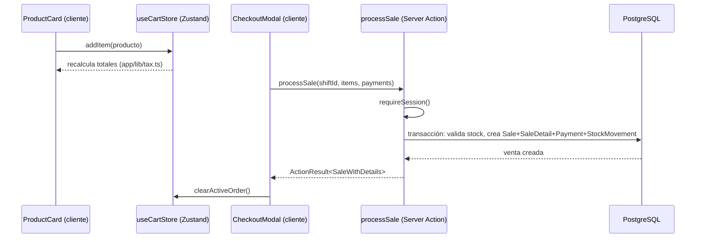

# Arquitectura

Oneiros POS es un único proyecto **Next.js 16 (App Router)** que hace de frontend y backend a la vez: no hay una API separada, la lógica de negocio vive en **Server Actions** dentro de `app/actions/`.

## Stack

| Capa | Tecnología |
|---|---|
| Framework | Next.js 16, App Router, Server Actions, Turbopack |
| UI | React 19, Tailwind v4 + shadcn/ui, CSS Modules para componentes con diseño propio |
| Estado cliente | Zustand con `persist` (ver [[07-Estado-cliente]]) |
| Base de datos | PostgreSQL (Neon en producción) vía Prisma 7 con `@prisma/adapter-pg` |
| Auth | NextAuth v4, proveedor de credenciales, sesión JWT |
| Tests | Vitest + Testing Library + `@vitest/coverage-v8` |
| Hosting | Vercel (proyecto `pos-oneiros`) |

## Por qué Server Actions y no una API REST/GraphQL separada

Todo `app/actions/*.ts` empieza con `"use server"`. Los componentes cliente llaman estas funciones directamente como si fueran funciones locales; Next.js genera el endpoint HTTP internamente. Ventajas para este proyecto:

- Un solo despliegue, sin CORS ni contratos de API que mantener sincronizados.
- Tipos compartidos automáticamente entre cliente y "backend" (son el mismo proyecto TypeScript).
- Cada acción valida su propia sesión con `requireSession()` / `requireManager()` / `requireAdmin()` (ver [[03-Autenticación-y-roles]]) — no hay middleware de autorización centralizado para las mutaciones, cada acción es responsable de sí misma.

## Flujo de una petición típica (vender un producto)

Puntos clave:
- El **servidor es la fuente de verdad de precios e impuestos** — el cliente solo envía `productId`, `quantity` y cómo se pagó. Ver [[04-Reglas-de-negocio]].
- Todo ocurre dentro de `prisma.$transaction()` para que no haya sobreventa de stock bajo concurrencia (dos cajas vendiendo al mismo tiempo).

## Rutas y proxy (antes `middleware.ts`)

Next.js 16 renombró `middleware.ts` a **`proxy.ts`**. Su única función aquí es un filtro barato:

- Sin token → redirige a `/login`.
- Token con rol `CASHIER` intentando entrar a `/admin` → redirige a `/pos`.

Deliberadamente **no** filtra `/login` (evita un loop de redirección) y **no** es la fuente de verdad de autorización — esa vive en cada página (`getServerSession()` fresco en `admin/layout.tsx` y `pos/page.tsx`) y en cada Server Action. Ver [[03-Autenticación-y-roles]] para el porqué de esta doble capa.

## Ver también

- [[02-Modelo-de-datos]]
- [[11-Estructura-de-carpetas]]
- [[08-Despliegue]]
