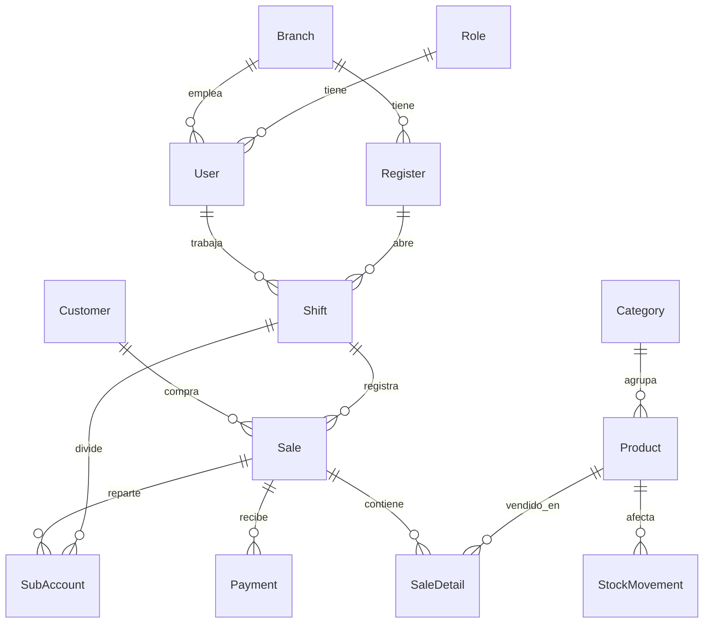

# Modelo de datos

Esquema completo en `prisma/schema.prisma`. 14 modelos, PostgreSQL.

## Entidades

### User / Role
- `User.role` es una relación a `Role` (no un enum de string) — permite ampliar permisos sin migración de esquema, aunque hoy en día `lib/auth.ts` trabaja con un enum TypeScript fijo (`"ADMIN" | "SUPERVISOR" | "CASHIER"`) por simplicidad. Ver [[03-Autenticación-y-roles]].
- `User.passwordChangedAt` — timestamp usado para invalidar sesiones JWT emitidas antes de un cambio de contraseña (ver esa misma nota).
- `User.branchId` es opcional (`Branch?`).

### Branch / Register
- `Branch` = sucursal física. `Register` = caja dentro de una sucursal, con `prefix` (ej. `"POS-1"`) y `nextNumber`, el consecutivo que se incrementa atómicamente en cada venta para formar el número de factura (`PREFIJO-N`).

### Shift (turno)
- Un `Shift` pertenece a un `User` y a un `Register`. `status` es `"OPEN"` o `"CLOSED"`.
- `baseAmount` = efectivo con el que se abre la caja; `closeAmount` = lo contado al cerrar.
- El cálculo de "esperado" al cerrar = `baseAmount + pagos en efectivo de las ventas del turno` (tarjeta/transferencia no pasan por el cajón).

### Category / Product
- `Product.stock` es `Float` (no entero) — permite productos que se venden por peso/volumen.
- Impuestos como porcentaje directo en el producto: `taxIva`, `taxIca`, `taxImpoConsumo` (ej. `19` = 19%). Se convierten a tasa decimal en `app/lib/tax.ts` (`toDecimalRate`).
- `isActive` = soft-delete: `deleteProduct` desactiva en vez de borrar si el producto tiene ventas asociadas (ver [[04-Reglas-de-negocio]]).
- `imageUrl` es una URL externa (no hay subida de archivos ni Vercel Blob) — debe empezar por `https://`.

### StockMovement (Kardex)
- Ledger inmutable de **todo** cambio de stock: `SALE`, `CANCEL`, `PURCHASE`, `ADJUSTMENT`, `WASTE`, `IMPORT`.
- `quantity` es con signo (negativo = sale del inventario); `stockAfter` guarda el saldo resultante — permite auditar sin recalcular desde cero.
- Indexado por `[productId, createdAt]` y `[createdAt]` para el reporte de movimientos.

### Sale / SaleDetail / Payment
- `Sale.source` distingue ventas hechas en el POS (`"POS"`) de las importadas desde Siigo (`"SIIGO"`), con `externalRef` guardando el número de factura original. `@@unique([source, externalRef])` evita importar la misma factura dos veces.
- `SaleDetail` **congela** `productName`/`productCode` al momento de la venta — si el producto cambia de nombre después, el histórico no se altera.
- `Sale.status`: `COMPLETED` | `SUSPENDED` | `CANCELLED`. Cancelar restaura el stock (ver [[04-Reglas-de-negocio]]) pero la venta queda en el historial para trazabilidad, nunca se borra.

### SubAccount (cuenta dividida)
- Modela "dividir la cuenta": una sola `Sale` puede tener varias `SubAccount`, cada una con su `label` (nombre de quien paga), sus `items` (snapshot en JSON) y si ya `paid`.

### Customer
- Opcional en una venta (`Sale.customerId` es nullable). `documentId` único cuando se define.

### SystemConfig
- Tabla clave-valor genérica (`key`/`value`, ambos `String`). Hoy se usa para flags como `allowNegativeStock` y ajustes de negocio (logo, mostrar precios con impuestos incluidos, etc. — ver `app/actions/settings.ts`).

## Migraciones

`prisma/migrations/` tiene 8 migraciones aplicadas. Las más recientes (todas de la sesión de "beta hardening"):

- `beta_hardening`, `line_discount`, `password_changed_at`, `stock_movements`, `password_changed_at_tz`

Aplicar en producción: `npm run db:migrate` (= `prisma migrate deploy`). **Importante en Neon:** usar el endpoint **directo** (sin `-pooler`) para este comando — ver [[08-Despliegue]].

## Ver también
- [[04-Reglas-de-negocio]]
- [[09-Scripts-de-mantenimiento]] (seed y reset en blanco)
